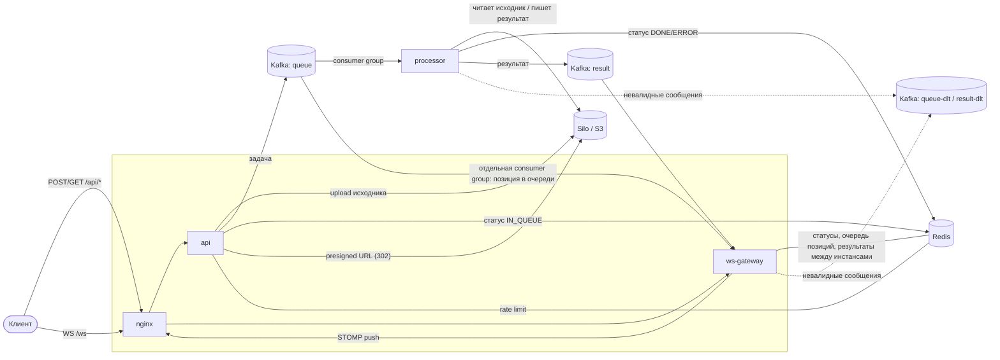

# AudioSystem

Сервис для изменения скорости и высоты тона (pitch) аудиофайлов без искажающих артефактов тайм-стретча.

## Идея

Ускорить или замедлить аудио можно двумя разными способами — с разными последствиями:
- **Без изменения pitch'а** (тайм-стретчинг) — применяется, когда нужно изменить скорость, не превращая голос в писк или бас. Сигнал режется на окна, дублируются/схлопываются куски волны и сшиваются обратно. На умеренных значениях звучит нормально, но на экстремальных (сильное ускорение/замедление) появляются артефакты.
- **Вместе с изменением pitch'а** (ресемплинг) — скорость и высота тона меняются синхронно, артефактов почти нет, но тональность уезжает вместе со скоростью.

Сервис поддерживает оба сценария и позволяет управлять скоростью и pitch'ом независимо — например, ускорить трек, сохранив исходную тональность, или наоборот, намеренно свести оба параметра вместе.

Так как процесс обработки аудио не мгновенен, реализация представлена в виде event-driven архитектуры с уведомлением через WebSocket или ручной проверкой состояния.

Вдохновителем стала ритм видео-игра osu!, в которой есть модификаторы режима Half-Time и Double-Time, а также их аналог с измененной высотой тона Daycore и Nightcore.

## Архитектура



**Сервисы:**

| Сервис                          | Роль                                                                                                                                                                                                                                                                                             |
| ------------------------------- | ------------------------------------------------------------------------------------------------------------------------------------------------------------------------------------------------------------------------------------------------------------------------------------------------ |
| `nginx`                         | единая точка входа для сервисов-интерфейсов. Маппинг: `/api/*` — `api`, `/ws` — `ws-gateway`                                                                                                                                                                                                     |
| `api`                           | занимается приемом и постановкой задачи на обработку файла, проверкой текущего состояния задачи и выдачи presigned-ссылки на результат. Включает в себя rate limiting для контроля нагрузки на сервис, общий для всех инстансов                                                              |
| `ws-gateway`                    | WebSocket/STOMP-шлюз для получения позиции в очереди и финального статуса задачи. Масштабируется: общее состояние инстансов лежит в Redis                                                                                                                                                       |
| `processor` (music-service)     | потребляет и обрабатывает задачи из очереди `queue`. Аудио обрабатывается через внешний DSP-обработчик ffmpeg/rubberband, а результат сохраняется в S3 хранилище. Результатом является публикация события в `result` и обновление состояния задачи. Идемпотентен относительно повторной доставки |
| Kafka                           | топики `queue` (задачи) и `result` (готовые статусы), ключ сообщения — `job_id`. Невалидные сообщения уходят в `queue-dlt` и `result-dlt`                                                                                                                                                        |
| Redis                           | статус задачи (`IN_QUEUE`/`DONE`/`ERROR` + TTL) — источник для `force-check` и для пуша при поздней WS-подписке. Также хранит бакеты rate limit `api`, очередь позиций `ws-gateway` и канал Pub/Sub для рассылки результатов между инстансами `ws-gateway`                                       |
| Silo (S3-совместимое хранилище) | исходники и результаты; presigned URL на скачивание, ILM-политика автоудаления результатов через сутки                                                                                                                                                                                           |

**Поток данных:** 
1. клиент грузит файл в `api`
2. `api` кладёт файл в S3, статус `IN_QUEUE` в Redis, сообщение в `queue` 
3. `processor` обрабатывает файл внешним процессом ffmpeg, пишет результат в S3, статус в Redis и в топик `result` 
4. `ws-gateway`, слушающий оба топика, пушит клиенту позицию в очереди и финальный статус по WebSocket. 
5. клиент делает отдельный запрос к `api`, который редиректит (`302`) на presigned S3-ссылку

Идентификатор задачи (`job_id`) формата **UUIDv7** для исключения IDOR через перебор и возрастания по времени создания. Последнее заложено для потенциального расширения системы в сторону хранения в РСУБД.

## Стек технологий

| Категория           | Выбор                                                                         |
| ------------------- | ----------------------------------------------------------------------------- |
| Язык / платформа    | Java 25, Spring Boot 4.1.1                                                    |
| Обмен сообщениями   | Kafka                                                                         |
| Кэш / статус задач  | Redis (Lettuce)                                                               |
| Объектное хранилище | Silo как форк MinIO, являющийся S3-совместимым хранилищем                     |
| DSP                 | ffmpeg (с фильтром rubberband) как внешний процесс                            |
| Rate limiting       | Bucket4j с бакетами в Redis, ключ — эндпоинт и IP клиента                     |
| Детекция типа файла | Apache Tika для определения по содержимому файла, а не по формату в  названии |
| API-документация    | springdoc-openapi                                                             |
| Reverse proxy       | nginx                                                                         |
| Оркестрация (dev)   | Docker Compose                                                                |

## Как запустить

Все сервисы собираются и поднимаются через `docker compose` с явным списком файлов — у compose-конфигурации нет файла по умолчанию, это осознанный выбор (комбинации ниже взаимоисключающие или дополняющие).

Базовый стек (интерфейс + Kafka в компактном варианте + Redis + Silo + processor):

```bash
docker compose \
  -f docker-compose-interface.yml \
  -f docker-compose-kafka-compact.yml \
  -f docker-compose-redis.yml \
  -f docker-compose-silo.yml \
  -f docker-compose-processor.yml \
  up --build
```

После старта API доступен на `http://localhost:8080/api`, WebSocket — `ws://localhost:8080/ws`, Swagger UI — `http://localhost:8080/api/swagger-ui.html`.

**Вариант Kafka-брокера** — выбирается подстановкой одного из двух overlay-файлов, остальной стек не меняется:
- `docker-compose-kafka-compact.yml` — предоставляет 1 брокер с 1 партицией. Удобен для локальных запусков или при сильных ограничениях в ресурсах, но отсутствует возможность параллельной обработки;
- `docker-compose-kafka-common.yml` — три брокера (`kafka-0/1/2`), образующих KRaft-кворум с 3 партициями и 3 репликами. Поддерживает горизонтальное масштабирование `processor`.

**Масштабирование `processor`** возможно из двух точек:
- число инстансов: `--scale processor=N`. Имеет смысл только с `docker-compose-kafka-common.yml`;
- конкурентность consumer'а внутри одного инстанса: `spring.kafka.concurrency=${KAFKA_CONCURRENCY:1}` в самом сервисе. Параметр существует как доступный рычаг, но **не прокинут** ни в один compose-файл по умолчанию — чтобы включить, нужно явно добавить `KAFKA_CONCURRENCY=<N>` в `environment:` сервиса `processor`.

**Масштабирование `api` и `ws-gateway`** — `--scale api=N ws-gateway=N`.

```bash
docker compose \
  -f docker-compose-interface.yml \
  -f docker-compose-kafka-common.yml \
  -f docker-compose-redis.yml \
  -f docker-compose-silo.yml \
  -f docker-compose-processor.yml \
  up --build --scale processor=3
```

Поддерживаемые форматы на выходе: `mp3`, `wav`, `ogg`, `opus`, `m4a`, `aac`, `flac`, `webm`, `aiff`/`aif` (обложка альбома сохраняется для `mp3`/`m4a`/`flac`).

## Обработка ошибок Kafka

Обработка ошибок при чтении из Kafka устроена одинаково в `ws-gateway` и `processor`. Специфика каждого сервиса описана в его README.

**Разбор сообщения.** Ключ и значение разбираются через `ErrorHandlingDeserializer`: если сообщение не удалось разобрать, ошибка не ломает чтение топика, а передаётся обработчику ошибок вместе с исходными байтами. Ошибкой разбора считаются:
- ключ не в формате UUID;
- битый JSON;
- поле, которого нет в контракте (сообщение из чужого топика или несовместимой версии);
- сообщение, не прошедшее валидатор сервиса.

Пустое значение тоже отклоняется — его не принимает сам слушатель.

**Временные и постоянные ошибки.** Обработчик ошибок (`DefaultErrorHandler`) делит ошибки на два вида:
- **Временные** — недоступность Redis. Сообщение повторяется с нарастающей паузой (до 30 секунд между попытками) без ограничения числа попыток: сервис ждёт восстановления Redis и не теряет сообщение. Пока идут повторы, чтение этой партиции стоит.
- **Постоянные** — всё остальное. Повтор не поможет, поэтому сообщение сразу отправляется в DLT (dead letter topic): `queue-dlt` для `queue`, `result-dlt` для `result`. В заголовках сообщения сохраняются исходный топик, партиция, offset, consumer group и причина ошибки.

`queue` читают две группы (`processor` и `ws-gateway`), поэтому одно невалидное сообщение может попасть в `queue-dlt` дважды — по разу от каждой группы. Различить копии можно по заголовку `kafka_dlt-original-consumer-group`.

**Логирование.** Каждая неудачная попытка, отправка в DLT и неудачная отправка в DLT пишутся в лог (`LoggingRetryListener`) с номером попытки, топиком, партицией, offset и причиной.

**Топики DLT** создаются вместе с основными, через `kafka-topic-init` сервис в compose-файлах Kafka, с тем же числом партиций. Сообщение отправляется в DLT в ту же партицию, из которой было прочитано.

## Модули

- [`api/`](api/README.md) — REST API: приём задач, presets, force-check статуса, скачивание результата
- [`ws-gateway/`](ws-gateway/README.md) — WebSocket/STOMP-шлюз для пуша статуса клиенту
- [`processor/`](processor/README.md) — music-service: DSP-обработка и публикация результата

## Лицензия

MIT — см. `LICENSE` в каждом модуле.
